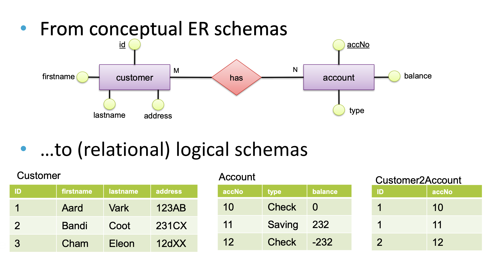

# Information & Data Management
> IDM (CSE1505) 26-27 Jun 2021 - by robomonk - im wasting time just typing this

###  Introduction
> intro, tag
* Target is to compress as much information as possible regarding databases into this hopefuly not so huge README

## Database Management Systems (DBMS)
They allow to:
* definition of data & structure
* physical contstruction
* data manipulation
* sharing/protecting 
* persistence/recovery

### Data Models
> how is the db structured??
* *Relational Data Model* (the big player in the game)
* Network
* Hierarchical
* Object oriented

## Relational Databases
* Strict data modelling
* Controlled redundancy
* Data normalization
* Data consisterncy & integrity constraints
* *ACID* Transaction support
* SQL - declerative query language
* Effective & secure data sharing
* Backup & recovery

## Data Modelling

### Conceputal Schema 
* which entities should be stored, what are their properties & how are they related 

### Relational Logical Schema
* which relations should exist, which attributes do they have, what are the domains (data types) of the attributes, and which constraints should hold?

### Physical Schema
* where and how to store relations, what to indec, what metadata to collect etc.

## Relational Model
* Based on relations (relation: set of tuples w/ the same domain)
* Db relations are descibed by schemas
	- schemas provide the domains (Di) and constrains for each relation
	- egg. `R ⊆ D1 × .. × Dn`

* relations are well-defined mathematical concepts

### Functional dependencies
> aka FD
* semanitc properties of the underlying domain & data model
* they're between sets of attributes
* FD are manually defined by the db designed
#### FD underping keys
* candiate key - simple key
	* irreducible set of attrs which uniquely identifies a tuple
* superkey
	* a superset of a canidate key - only uniquness is required
* primary key
	* a primary key is one single key chosen from the set of candiate keys by the db designer
	
## Normal Forms
> aka NF
* 1NF, 2NF, 3NF, BCNF, 4NF, 5NF, 6NF ( the higher the number the more strict the requirements, less anomalies & redundancy, better design quality
* typically we like the 3NF
### 1NF
* relation has only atomic values (no sets or substructures allowed)
### 2NF
* is in 1NF
* no nonkey attr is functionally dependent on a proper subset of any canditate key
### 3NF
* in 2NF
* all nonkey attributes are determined only by the canditate key

## NoSQL & NewSQL
* NoSQL sacrifice features of relational dbms for performance
* newSQL new ways of implementing core features

## SQL
* Queries (`SELECT`)
* Data Manipulation (`INSERT`, `UPDATE`, `DELETE`)
* Data definition (`CREATE TABLE`, `ALTER TABLE`, `DROP TABLE`)

## ACID
> haha
* Atomicity - a transaction is either executed completely (commit) or not at all (abort)
* Consistency - a transaction transforms a consistent database state into a (possibly different) consistent database state
* Isolation - a transaction is executed in isolation
* Durability - a succesfully completed transaction has a permament effect on the db

