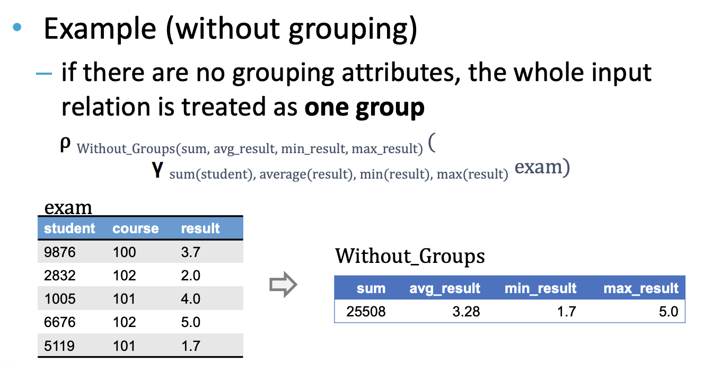
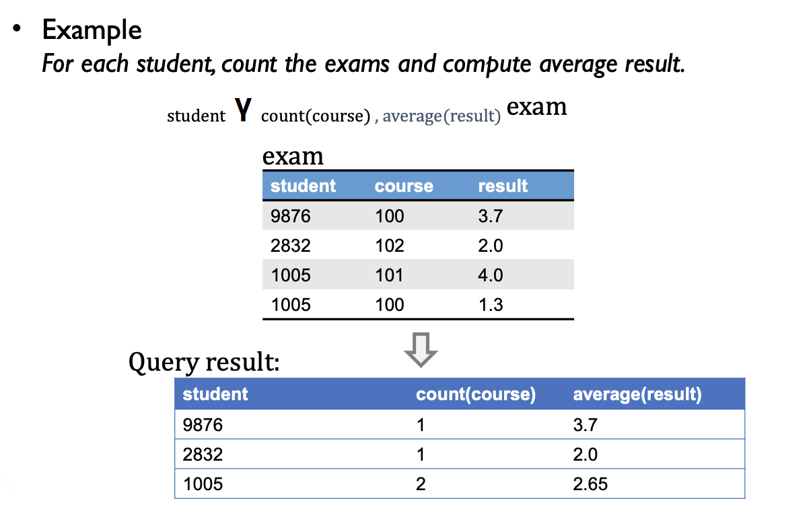
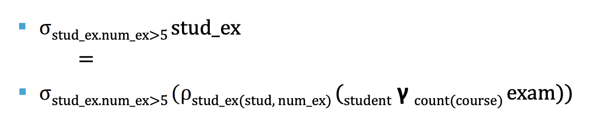

# Relational Algebra

## Operations

#### Set operations
* Union ∪
* Intersection ∩
* Diff ∖
* Cartesian Product ×

##### Cartesian Product
A = [ 1, 2, 3 ]
B = [ a, b, c ]

A × B = [ (1,a),(1,b),(1,c),(2,a),(2,b),(2,c),(3,a),(3,b),(3,c) ]


#### Relational operations
* Selection σ
* Projecting π
* Renaming ρ

## σ 
##### σ[sex=female] (students)
* select all female students
* `select * from students where sex=female`

##### σ[course=100 && result>=3.0] (exams)
* `select * from exams where course=100 && result>=3.0`


## π
* retains only collumns with given names
* if tuples are identical after projection, duplicate tuples are removed

##### π[title] (Courses)
* `select title from courses`

##### π[firstName, lastName] σ[sex=female] (students)
* `select firstName, lastName from students where sex=female`


## Algebra Set Operators

##### σ[crs_no=100] (Course) ∪ σ[crs_no=102] (Course)
```sql
select * from course where crs_no=100
union
select * from course where crs_no=102
```

## ρ
* unary operation 
* give names explicitly to the fields of a relation instance
* break large RA into smaller subexpressions
* similar to SQL's As

##### ρ[s] (Student)
* `select s.* from Student s`

##### ρ[fn, ln] (π[firstName, lastName] (Students))
* `select firstname as fn, lastname as ln from student`

##### ρ[s(sno, fn, ln,s)] (Student)
```sql
SELECT s. std_no AS sno, s.firstname AS fn, s. lastname AS ln, s.sex AS s
FROM Student AS s
```


## ×
* a cartesian product followed by a proper selection is a JOIN

##### π[lastname, title, result] σ[student.s_id=exam.s_id ∧ course.c_id=exam._c_id] (Student × exam × Course)

```sql
SELECT lastname, title, result
FROM Student s, Exam e, Course c
WHERE e.s_id=s.s_id AND e.c_id=c.c_id
```


##  ⋈ [θ]
* creates a new relation by combining related tuples from different sources (θ is a bool)

##### π[lastname, title, result] (Student⋈[std_no=student] exam⋈[course=crs_no] Course) 
```sql
SELECT lastname, title, result
FROM Student JOIN exam ON std_no=student
JOIN Course ON course=crs_no
```
* equivelant to:
```sql
SELECT lastname, title, result
FROM Student, exam, Course
WHERE std_no=student AND course=crs_no
-- π[lastname, title, result] σ[std_no=student ∧ course=crs_no] (Student × exam × Course)
```

## ⋈
* natural join

##### π[lastname, title, result] (Student ⋈ (ρs(std_no<- student, crs.no <- course) (exam) ⋈ Course)
* equivelant to
##### π[lastname, title, result] (σ[student.std_no=exam.student ∧ course.crs.no=exam. course] (Student × exam × Course) )


## γ
* aggregation



